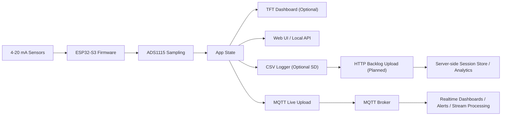

# Motorsport Data Acquisition

ESP32-S3 Arduino/PlatformIO firmware for a configurable 4-20 mA motorsport logger and dashboard.

## Features
- Reads a configurable set of 4-20 mA sensors through an ADS1115-based analog front end
- Displays live gauges and diagnostics on a 480x320 SPI TFT
- Logs CSV data to microSD with DS3231 RTC timestamps
- Serves a lightweight Wi-Fi dashboard and CSV download endpoints
- Publishes live telemetry over MQTT when station Wi-Fi and broker settings are configured
- Keeps pin mapping, sensor calibration, and refresh rates in one config file

## Required hardware

This project is documented around a module-first build so the analog front end and power chain use off-the-shelf parts wherever practical. The core logger only needs the controller, ADC, sensor-interface modules, power hardware, and button. The TFT, RTC, and SD logging hardware are optional additions that can be enabled in software when fitted.

### Core bill of materials

| Qty | Item | Notes |
| --- | --- | --- |
| 1 | [ESP32-S3 DevKitC-1 class board](https://www.digikey.com/en/products/detail/espressif-systems/ESP32-S3-DEVKITC-1-N8/15199021) | Main controller supported by [`platformio.ini`](platformio.ini) and the default pin map |
| 1 | [ADS1115 breakout](https://www.digikey.com/en/products/detail/adafruit-industries-llc/1085/5761229) | External ADC used to read the sensor-interface module outputs |
| 2 | [4-20 mA receiver/current-to-voltage modules](https://www.digikey.com/en/products/detail/dfrobot/SEN0262/9559248) | One module per sensor channel; this replaces the custom shunt/filter front end |
| 1 | [Momentary push button](https://www.digikey.com/en/products/detail/adafruit-industries-llc/471/7349483) | UI screen switch and fault clear input |
| 1 | [Fused 12 V input path](https://www.bluesea.com/products/5064/) | Inline fuse holder or a prebuilt fused automotive input lead |
| 1 | [12 V reverse-polarity/transient protection module](https://www.pololu.com/product/5380) | Preferred over building the protection stage from discrete parts |
| 1 | [12 V to 5 V buck converter module](https://www.digikey.com/en/products/detail/pololu/2851/10451177) | Supplies the ESP32, TFT, ADC, RTC, and loop interface hardware |
| 1 | [Enclosure and wiring set](https://www.printables.com/tag/projectbox) | Printed or purchased enclosure, plus connectors, terminals, mounting hardware, and harness materials |

### Optional additions

| Qty | Item | Notes |
| --- | --- | --- |
| 1 | [3.5 inch 480x320 SPI TFT with ST7796S controller](https://www.waveshare.com/3.5inch-capacitive-touch-lcd.htm) | Optional local dashboard display; if omitted, disable `displayEnabled` in [`include/AppConfig.h`](include/AppConfig.h) |
| 1 | [DS3231 RTC module with backup coin cell](https://www.digikey.com/en/products/detail/adafruit-industries-llc/5188/15189155) | Optional real-time clock for persistent timestamps; if omitted, disable `rtcEnabled` and the firmware falls back to uptime-based timestamps |
| 1 | [microSD breakout or integrated SD socket](https://www.digikey.com/en/products/detail/adafruit-industries-llc/254/5761230) | Optional CSV logging hardware; if omitted, disable `sdLoggingEnabled` and the logger runs without on-device file storage |

### Integration notes
- Enable or disable the optional TFT, RTC, and SD logging hardware in [`include/AppConfig.h`](include/AppConfig.h) via `kFeatures`.
- Live MQTT upload is also controlled in [`include/AppConfig.h`](include/AppConfig.h) via `kFeatures.liveUploadEnabled` and `kLiveUpload`.
- The firmware sensor list is defined in [`include/AppConfig.h`](include/AppConfig.h), so future channels can be added there without changing the overall project structure.
- The default wiring and pin map are documented in [`docs/hardware-setup.md`](docs/hardware-setup.md) and [`include/PinDefinitions.h`](include/PinDefinitions.h).
- A practical module for each 4-20 mA channel is the [DFRobot Gravity Analog Current to Voltage Converter](https://www.digikey.com/en/products/detail/dfrobot/SEN0262/9559248).
- External 4-20 mA transmitters are treated as field devices feeding the logger, not part of the logger BOM.
- If SD logging hardware is installed, the logger expects removable microSD media at runtime, but the card itself is treated as consumable media rather than a BOM line item.
- If the TFT controller, ESP32 pinout, or storage wiring differs from the defaults, update the hardware definitions before flashing.
- Re-check the channel scaling in [`include/AppConfig.h`](include/AppConfig.h) so the firmware matches the output range of the chosen 4-20 mA receiver module.

## Project layout
- [`platformio.ini`](platformio.ini)
- [`include/AppConfig.h`](include/AppConfig.h)
- [`include/LiveUpload.h`](include/LiveUpload.h)
- [`src/main.cpp`](src/main.cpp)
- [`src/LiveUpload.cpp`](src/LiveUpload.cpp)
- [`docs/hardware-setup.md`](docs/hardware-setup.md)

## Build and flash
1. Install PlatformIO Core or use the PlatformIO VS Code extension.
2. Review the pin mapping in [`include/PinDefinitions.h`](include/PinDefinitions.h) and update it for the actual ESP32-S3 dev board and TFT used.
3. Review sensor ranges, Wi-Fi credentials, timing values, live upload settings, and optional hardware toggles in [`include/AppConfig.h`](include/AppConfig.h).
4. Build and upload with `pio run -t upload`.
5. Open the serial monitor with `pio device monitor`.

## Live streaming

The firmware now includes a live telemetry publisher for near-real-time upload. The current implementation uses MQTT for the live path and is disabled by default. Enable it in [`include/AppConfig.h`](include/AppConfig.h), switch Wi-Fi to station mode, and set the MQTT broker details in `kLiveUpload`.

Current behavior:
- The device publishes live sensor snapshots to MQTT on a fixed interval.
- Each message includes a normalized `device_id`, a per-boot `session_id`, a monotonic `sequence`, the current timestamp, and the current sensor values.
- The retained MQTT status topic now reflects both online and offline state so downstream consumers do not keep stale liveness.
- The firmware exposes live upload state through the local web UI and `/api/live`.
- Local SD logging remains the durable on-device record when SD logging is enabled.

Current limits:
- This repository currently implements the MQTT live stream only.
- HTTP backlog upload and store-and-forward replay are not implemented yet.
- For motorsport use with spotty connectivity, the intended next step is an HTTP batch uploader that drains unsent SD log segments after connectivity returns.

Mermaid overview:



Recommended configuration model:
- Use MQTT for low-latency live telemetry.
- Keep SD logging enabled when durable local recovery matters.
- Add a later HTTP backlog uploader for reliable store-and-forward of missed samples.

Default MQTT topic layout:
- `<topicPrefix>/<deviceId>/live`
- `<topicPrefix>/<deviceId>/status`

Example live payload shape:

```json
{
  "device_id": "mda-logger",
  "session_id": "mda-logger-boot-42",
  "sequence": 12,
  "timestamp": "2026-04-05 10:15:30",
  "uptime_ms": 15234,
  "sensors": [
    {
      "id": "oil_pressure",
      "name": "Oil Pressure",
      "value": 4.812,
      "units": "bar",
      "loop_mA": 11.699,
      "fault": "none"
    }
  ]
}
```

## Host-side tests
- Run `./scripts/run-host-tests.sh` to execute hardware-independent logic tests on a desktop machine.
- These tests cover sensor current conversion, threshold faults, engineering-value clamping, filter behavior, RTC/fallback timestamp formatting, and log filename sanitization edge cases.
- GitHub Actions is configured to run the same host test suite on pushes and pull requests in [host-tests.yml](.github/workflows/host-tests.yml).

## Runtime controls
- Short press the UI button to switch between the main gauge screen and the diagnostics screen.
- Hold the UI button for 1.2 seconds to clear latched sensor faults.

## Web endpoints
- `/` simple phone-friendly dashboard mirror
- `/api/live` current readings and system state as JSON
- `/api/files` available CSV files on the SD card
- `/download/<file>` fetch a CSV log file
