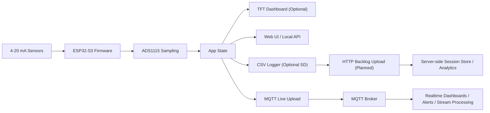

# Motorsport Data Acquisition

ESP32-S3 Arduino/PlatformIO firmware for a configurable 4-20 mA motorsport logger and dashboard.

## Features
- Reads a configurable set of 4-20 mA sensors through an ADS1115-based analog front end
- Displays live gauges and diagnostics on a 480x320 SPI TFT
- Logs CSV data to microSD with RTC timestamps when RTC hardware is fitted
- Serves a lightweight Wi-Fi dashboard and CSV download endpoints
- Publishes live telemetry over MQTT when station Wi-Fi and broker settings are configured
- Keeps pin mapping, sensor calibration, and refresh rates in one config file

## Required hardware

This project targets a TinyS3-based logger with external 4-20 mA receiver modules and optional display, RTC, and storage hardware.

For the detailed BOM, pin table, wiring guidance, and commissioning steps, see [docs/hardware-setup.md](docs/hardware-setup.md).

Primary source files:
- board target: [`platformio.ini`](platformio.ini)
- pin map: [`include/PinDefinitions.h`](include/PinDefinitions.h)
- firmware feature defaults: [`include/AppConfig.h`](include/AppConfig.h)
- wiring and hardware details: [`docs/hardware-setup.md`](docs/hardware-setup.md)

## Project layout
- [`platformio.ini`](platformio.ini)
- [`include/AppConfig.h`](include/AppConfig.h)
- [`include/PinDefinitions.h`](include/PinDefinitions.h)
- [`include/LiveUpload.h`](include/LiveUpload.h)
- [`src/main.cpp`](src/main.cpp)
- [`src/LiveUpload.cpp`](src/LiveUpload.cpp)
- [`docs/hardware-setup.md`](docs/hardware-setup.md)
- [`docs/repo-contracts.md`](docs/repo-contracts.md)

## Build and flash
1. Install PlatformIO Core or use the PlatformIO VS Code extension.
2. Review the pin mapping in [`include/PinDefinitions.h`](include/PinDefinitions.h) and update it for the actual ESP32-S3 dev board and TFT used.
3. Review sensor ranges, timing values, live upload settings, and optional hardware toggles in [`include/AppConfig.h`](include/AppConfig.h). Copy `include/AppSecrets.example.h` to the ignored `include/AppSecrets.h` and set Wi-Fi/MQTT credentials there.
4. Run [`scripts/verify-repo.sh`](scripts/verify-repo.sh) `--fast` for host-side verification and contract checks, and `--full` when the local PlatformIO toolchain is available.
5. Build and upload with `pio run -t upload`.
6. Open the serial monitor with `pio device monitor`.

## Live streaming

The firmware now includes a live telemetry publisher for near-real-time upload. The current implementation uses MQTT for the live path and is disabled by default. Enable it in [`include/AppConfig.h`](include/AppConfig.h), switch Wi-Fi to station mode, and configure the broker and credentials in an ignored `include/AppSecrets.h` created from [`include/AppSecrets.example.h`](include/AppSecrets.example.h).

Production brokers require authentication. Set `APEXI_MQTT_USERNAME` to the same normalized value as `kLiveUpload.deviceId`; the broker ACL uses that identity to limit the device to `<topicPrefix>/<deviceId>/live` and `<topicPrefix>/<deviceId>/status`. Keep the matching password in the encrypted infrastructure vault and never commit `AppSecrets.h`.

Current behavior:
- The device publishes live sensor snapshots to MQTT on a fixed interval.
- Each message includes `schema_version`, a normalized `device_id`, a per-boot `session_id`, a monotonic `sequence`, the current timestamp, and the current sensor values.
- The retained MQTT status topic now reflects both online and offline state so downstream consumers do not keep stale liveness.
- The firmware exposes live upload state through the local web UI and `/api/live`.
- Local SD logging remains the durable on-device record when SD logging is enabled.

### Starting and stopping a live session

There is no separate start-event command in the firmware. When `kFeatures.liveUploadEnabled` is `true` and station Wi-Fi/MQTT are configured, each device boot creates a new `<deviceId>-boot-<id>` session and starts publishing as soon as Wi-Fi and MQTT connect.

Before using the logger on track:

1. Confirm the local UI reports station Wi-Fi connected and `MQTT LIVE`.
2. Check `/api/live` under `system` for `upload_enabled: true`, `upload_connected: true`, the expected `upload_session_id`, an increasing `upload_sequence`, and an empty `last_upload_error`.
3. Confirm the corresponding session appears in the telemetry app's **Ungrouped Sessions**, then attach it to the prepared event.

Powering down, losing Wi-Fi, or losing MQTT marks the stream offline through retained status or the MQTT last will. The telemetry app owns durable session finalization; the device does not finalize server-side data. Follow the telemetry app [Live Event Operations runbook](https://github.com/V5U2/motorsport-telemetry-app/blob/main/docs/live-events.md) for the complete race-day procedure.

Current limits:
- This repository currently implements the MQTT live stream only.
- HTTP backlog upload and store-and-forward replay are not implemented yet.
- For motorsport use with spotty connectivity, the intended next step is an HTTP batch uploader that drains unsent SD log segments after connectivity returns.

Mermaid overview:


```mermaid
flowchart LR
    A["4-20 mA Sensors"] --> B["ESP32-S3 Firmware"]
    B --> C["ADS1115 Sampling"]
    C --> D["App State"]
    D --> E["TFT Dashboard (Optional)"]
    D --> F["Web UI / Local API"]
    D --> G["CSV Logger (Optional SD)"]
    D --> H["MQTT Live Upload"]
    H --> I["MQTT Broker"]
    I --> J["Realtime Dashboards / Alerts / Stream Processing"]
    G --> K["HTTP Backlog Upload (Planned)"]
    K --> L["Server-side Session Store / Analytics"]
```

Recommended configuration model:
- Use MQTT for low-latency live telemetry.
- Keep SD logging enabled when durable local recovery matters.
- Add a later HTTP backlog uploader for reliable store-and-forward of missed samples.

Default MQTT topic layout:
- `<topicPrefix>/<deviceId>/live`
- `<topicPrefix>/<deviceId>/status`

MQTT payload compatibility:
- Current live and status payloads use `schema_version: 1`.
- Version `1` keeps the existing live/status fields stable for deployed bridge and app consumers.
- Future incompatible payload changes must bump `Logic::kLivePayloadSchemaVersion`, update this README, and keep bridge tests accepting version `1` during rollout.

Example live payload shape:

```json
{
  "schema_version": 1,
  "device_id": "mda-logger",
  "session_id": "mda-logger-boot-42",
  "sequence": 12,
  "timestamp": "2026-04-05 10:15:30",
  "uptime_ms": 15234,
  "sensors": [
    {
      "id": "oil_pressure",
      "name": "Oil Pressure",
      "value": 4.812,
      "units": "bar",
      "loop_mA": 11.699,
      "fault": "none"
    }
  ]
}
```

## Host-side tests
- Run `./scripts/run-host-tests.sh` to execute hardware-independent logic tests on a desktop machine.
- These tests cover sensor current conversion, threshold faults, engineering-value clamping, filter behavior, RTC/fallback timestamp formatting, and log filename sanitization edge cases.
- GitHub Actions is configured to run the repo fast verification path on pushes and pull requests in [host-tests.yml](.github/workflows/host-tests.yml).

## Runtime controls
- Short press the UI button to switch between the main gauge screen and the diagnostics screen.
- Hold the UI button for 1.2 seconds to clear latched sensor faults.

## Web endpoints
- `/` simple phone-friendly dashboard mirror
- `/api/live` current readings and system state as JSON
- `/api/files` available CSV files on the SD card
- `/download/<file>` fetch a CSV log file
