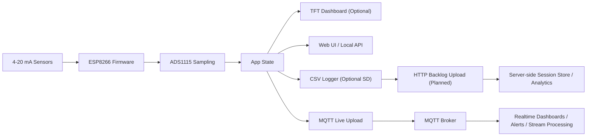

# Motorsport Data Acquisition

ESP8266 Arduino/PlatformIO firmware for a configurable 4-20 mA motorsport logger and dashboard, targeting the NodeMCU 1.0 / ESP-12E DevKit V2.

## Features
- Reads a configurable set of 4-20 mA sensors through an ADS1115-based analog front end
- Displays live gauges and diagnostics on a 480x320 SPI TFT
- Logs CSV data to microSD with RTC timestamps when RTC hardware is fitted
- Serves a lightweight Wi-Fi dashboard and CSV download endpoints
- Publishes live telemetry over MQTT when station Wi-Fi and broker settings are configured
- Lights the NodeMCU built-in LED steadily once firmware setup begins
- Keeps pin mapping, sensor calibration, and refresh rates in one config file
- Synchronises the RV-3028 from NTP at every networked boot and hourly thereafter, while retaining RTC holdover when offline

## Required hardware

This project targets a NodeMCU 1.0 / ESP-12E DevKit V2 logger with external 4-20 mA receiver modules. The supported default uses a 0-8 bar pressure transmitter through a DFRobot SEN0262 into ADS1115 channel A0 and a 0-150 degrees Celsius temperature transmitter through a second SEN0262 into channel A1. Field transmitters are ordered for direct operation from the protected 12 V vehicle supply; the 24 V boost path is only a fallback when a transmitter cannot meet its loop compliance requirement at 12 V.

For the detailed BOM, pin table, wiring guidance, and commissioning steps, see [docs/hardware-setup.md](docs/hardware-setup.md).

Primary source files:
- board target: [`platformio.ini`](platformio.ini)
- pin map: [`include/PinDefinitions.h`](include/PinDefinitions.h)
- firmware feature defaults: [`include/AppConfig.h`](include/AppConfig.h)
- wiring and hardware details: [`docs/hardware-setup.md`](docs/hardware-setup.md)

## Project layout
- [`platformio.ini`](platformio.ini)
- [`include/AppConfig.h`](include/AppConfig.h)
- [`include/PinDefinitions.h`](include/PinDefinitions.h)
- [`include/LiveUpload.h`](include/LiveUpload.h)
- [`src/main.cpp`](src/main.cpp)
- [`src/LiveUpload.cpp`](src/LiveUpload.cpp)
- [`docs/hardware-setup.md`](docs/hardware-setup.md)
- [`docs/repo-contracts.md`](docs/repo-contracts.md)

## Build and flash
1. Install PlatformIO Core or use the PlatformIO VS Code extension.
2. Wire the NodeMCU using the D-label/GPIO table in [`docs/hardware-setup.md`](docs/hardware-setup.md), then review [`include/PinDefinitions.h`](include/PinDefinitions.h).
3. Review sensor ranges, timing values, live upload settings, and optional hardware toggles in [`include/AppConfig.h`](include/AppConfig.h). Copy `include/AppSecrets.example.h` to the ignored `include/AppSecrets.h` and set Wi-Fi/MQTT credentials there.
4. Run [`scripts/verify-repo.sh`](scripts/verify-repo.sh) `--fast` for host-side verification and contract checks, and `--full` when the local PlatformIO toolchain is available.
5. Build and upload with `pio run -t upload --upload-port /dev/cu.usbserial-10`, replacing the port when needed.
6. Open the serial monitor at 115200 baud with `pio device monitor`. If a CH340-based board stays in reset, open the port with DTR and RTS inactive or press the board's `RST` button once.

## Wi-Fi firmware updates

The ESP8266 supports password-protected Arduino OTA updates while connected in station mode. Set a strong, unique `APEXI_OTA_PASSWORD` in the ignored `include/AppSecrets.h`; OTA remains locked when that value is empty. The local `/api/live` response reports `ota_enabled` and `ota_ready` so update availability can be checked without exposing the password.

The first OTA-capable firmware must be installed over USB. After that, build and upload on the same trusted network with the helper script, which reads the password from the ignored secrets header without printing it:

```sh
./scripts/upload-ota.sh mda-logger.local
```

An IP address can be supplied instead if `.local` discovery is unavailable. Do not commit the password or expose Arduino OTA beyond the trusted device network. OTA provides authenticated transfer, not transport encryption.

## Live streaming

The firmware now includes a live telemetry publisher for near-real-time upload. The current implementation uses MQTT for the live path and is disabled by default. Enable it in [`include/AppConfig.h`](include/AppConfig.h), switch Wi-Fi to station mode, and configure the broker and credentials in an ignored `include/AppSecrets.h` created from [`include/AppSecrets.example.h`](include/AppSecrets.example.h).

The local dashboard shows the active upstream server and MQTT connection state. Open `/settings` to change the MQTT host, port, live-upload enable flag, primary and secondary NTP servers, POSIX timezone rule, and displayed timezone label. The page uses HTTP Digest authentication with username `admin` and the device's OTA password. These non-secret settings are stored in a checksummed flash-backed EEPROM record and survive power loss. MQTT credentials remain compiled from the ignored secrets header and are not exposed in the UI or API. Saving settings restarts the logger so the new endpoint and clock configuration are applied cleanly.

The default clock configuration uses `pool.ntp.org`, `time.google.com`, POSIX timezone rule `AWST-8`, and display label `AWST`. The dashboard reports whether the RTC has been synchronised from NTP during the current boot, plus the last successful synchronization time. A valid RTC remains the offline holdover source between network synchronizations. POSIX offsets have reversed signs: for example, Perth is `AWST-8`, UTC is `UTC0`, and Sydney with daylight saving is `AEST-10AEDT,M10.1.0,M4.1.0/3`.

The NodeMCU target has 4 MB onboard flash using the `eagle.flash.4m1m.ld` layout, which reserves 1 MB for a filesystem in addition to the small EEPROM-emulation record used here. The filesystem remains available for future queues or configuration artifacts; durable telemetry continues to belong on microSD to avoid unnecessary flash wear.

Production brokers require authentication. Set `APEXI_MQTT_USERNAME` to the same normalized value as `kLiveUpload.deviceId`; the broker ACL uses that identity to limit the device to `<topicPrefix>/<deviceId>/live` and `<topicPrefix>/<deviceId>/status`. Keep the matching password in the encrypted infrastructure vault and never commit `AppSecrets.h`.

Current behavior:
- The device publishes live sensor snapshots to MQTT on a fixed interval.
- Each message includes `schema_version`, a normalized `device_id`, a per-boot `session_id`, a monotonic `sequence`, the current timestamp, and the current sensor values.
- The retained MQTT status topic now reflects both online and offline state so downstream consumers do not keep stale liveness.
- The firmware exposes live upload state through the local web UI and `/api/live`.
- Local SD logging remains the durable on-device record when SD logging is enabled.

### Starting and stopping a live session

There is no separate start-event command in the firmware. When `kFeatures.liveUploadEnabled` is `true` and station Wi-Fi/MQTT are configured, each device boot creates a new `<deviceId>-boot-<id>` session and starts publishing as soon as Wi-Fi and MQTT connect.

Before using the logger on track:

1. Confirm the local UI reports station Wi-Fi connected and `MQTT LIVE`.
2. Check `/api/live` under `system` for `upload_enabled: true`, `upload_connected: true`, the expected `upload_session_id`, an increasing `upload_sequence`, and an empty `last_upload_error`.
3. Confirm the corresponding session appears in the telemetry app's **Ungrouped Sessions**, then attach it to the prepared event.

Powering down, losing Wi-Fi, or losing MQTT marks the stream offline through retained status or the MQTT last will. The telemetry app owns durable session finalization; the device does not finalize server-side data. Follow the telemetry app [Live Event Operations runbook](https://github.com/V5U2/motorsport-telemetry-app/blob/main/docs/live-events.md) for the complete race-day procedure.

Current limits:
- This repository currently implements the MQTT live stream only.
- HTTP backlog upload and store-and-forward replay are not implemented yet.
- For motorsport use with spotty connectivity, the intended next step is an HTTP batch uploader that drains unsent SD log segments after connectivity returns.

Mermaid overview:


```mermaid
flowchart LR
    A["4-20 mA Sensors"] --> B["ESP8266 Firmware"]
    B --> C["ADS1115 Sampling"]
    C --> D["App State"]
    D --> E["TFT Dashboard (Optional)"]
    D --> F["Web UI / Local API"]
    D --> G["CSV Logger (Optional SD)"]
    D --> H["MQTT Live Upload"]
    H --> I["MQTT Broker"]
    I --> J["Realtime Dashboards / Alerts / Stream Processing"]
    G --> K["HTTP Backlog Upload (Planned)"]
    K --> L["Server-side Session Store / Analytics"]
```

Recommended configuration model:
- Use MQTT for low-latency live telemetry.
- Keep SD logging enabled when durable local recovery matters.
- Add a later HTTP backlog uploader for reliable store-and-forward of missed samples.

Default MQTT topic layout:
- `<topicPrefix>/<deviceId>/live`
- `<topicPrefix>/<deviceId>/status`

MQTT payload compatibility:
- Current live and status payloads use `schema_version: 1`.
- Version `1` keeps the existing live/status fields stable for deployed bridge and app consumers.
- Future incompatible payload changes must bump `Logic::kLivePayloadSchemaVersion`, update this README, and keep bridge tests accepting version `1` during rollout.

Example live payload shape:

```json
{
  "schema_version": 1,
  "device_id": "mda-logger",
  "session_id": "mda-logger-boot-42",
  "sequence": 12,
  "timestamp": "2026-04-05 10:15:30",
  "uptime_ms": 15234,
  "sensors": [
    {
      "id": "oil_pressure",
      "name": "Oil Pressure",
      "value": 4.812,
      "units": "bar",
      "loop_mA": 11.699,
      "fault": "none"
    }
  ]
}
```

## Host-side tests
- Run `./scripts/run-host-tests.sh` to execute hardware-independent logic tests on a desktop machine.
- These tests cover sensor current conversion, threshold faults, engineering-value clamping, filter behavior, RTC/fallback timestamp formatting, and log filename sanitization edge cases.
- GitHub Actions is configured to run the repo fast verification path on pushes and pull requests in [host-tests.yml](.github/workflows/host-tests.yml).

## Runtime controls
- Short press the UI button to switch between the main gauge screen and the diagnostics screen.
- Hold the UI button for 1.2 seconds to clear latched sensor faults.

## Web endpoints
The checked-in default is station mode. Create the ignored `include/AppSecrets.h` from the example and provide a 2.4 GHz SSID/password; `fast_connect`-style BSSID/channel pinning is not used, so the ESP8266 performs a normal network scan. If station association times out, firmware falls back to the open 2.4 GHz SoftAP `MDA-LOGGER` at `http://192.168.44.1` on channel 6. Set `AppConfig::kWifi.apPassword` to an 8+ character WPA2 key if a closed fallback AP is required.
- `/` simple phone-friendly dashboard mirror
- `/api/live` current readings and system state as JSON
- `/api/files` available CSV files on the SD card
- `/download/<file>` fetch a CSV log file
