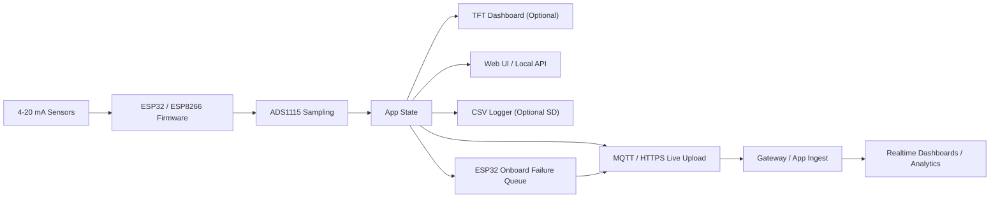

# Motorsport Data Acquisition

Arduino/PlatformIO firmware for a configurable 4-20 mA motorsport logger and dashboard, targeting classic ESP32 DevKit/WROOM-class boards and the NodeMCU 1.0 / ESP-12E DevKit V2.

## Features
- Reads a configurable set of 4-20 mA sensors through an ADS1115-based analog front end
- Displays live gauges and diagnostics on a 480x320 SPI TFT
- Logs CSV data to microSD with RTC timestamps when RTC hardware is fitted
- Serves a lightweight Wi-Fi dashboard and CSV download endpoints
- Publishes live telemetry over MQTT or authenticated HTTPS when station Wi-Fi and upstream settings are configured
- Buffers retryable HTTPS failures in a persistent circular onboard-flash queue on the 16 MB ESP32 target and replays them oldest-first after recovery
- Lights the NodeMCU built-in LED steadily once firmware setup begins
- Keeps pin mapping, sensor calibration, and refresh rates in one config file
- Synchronises the RV-3028 from NTP at every networked boot and hourly thereafter, while retaining RTC holdover when offline
- Derives an immutable per-board ESP32 identity and loads owner credentials from an identity-bound USB provisioning record
- Disables fallback AP, password OTA, and local HTTP settings on ESP32; production-candidate builds also fail closed unless Secure Boot and flash encryption are active

## Required hardware

This project targets a NodeMCU 1.0 / ESP-12E DevKit V2 logger with external 4-20 mA receiver modules. The supported default uses a 0-8 bar pressure transmitter through a DFRobot SEN0262 into ADS1115 channel A0 and a 0-150 degrees Celsius temperature transmitter through a second SEN0262 into channel A1. Field transmitters are ordered for direct operation from the protected 12 V vehicle supply; the 24 V boost path is only a fallback when a transmitter cannot meet its loop compliance requirement at 12 V.

For the detailed BOM, pin table, wiring guidance, and commissioning steps, see [docs/hardware-setup.md](docs/hardware-setup.md). Production acceptance is tracked separately in the [hardware qualification plan](docs/production-hardware-qualification.md); the current hardware remains unqualified until its physical evidence and approval fields are complete.

Primary source files:
- board target: [`platformio.ini`](platformio.ini)
- pin map: [`include/PinDefinitions.h`](include/PinDefinitions.h)
- firmware feature defaults: [`include/AppConfig.h`](include/AppConfig.h)
- wiring and hardware details: [`docs/hardware-setup.md`](docs/hardware-setup.md)

## Project layout
- [`platformio.ini`](platformio.ini)
- [`include/AppConfig.h`](include/AppConfig.h)
- [`include/PinDefinitions.h`](include/PinDefinitions.h)
- [`include/LiveUpload.h`](include/LiveUpload.h)
- [`src/main.cpp`](src/main.cpp)
- [`src/LiveUpload.cpp`](src/LiveUpload.cpp)
- [`docs/hardware-setup.md`](docs/hardware-setup.md)
- [`docs/repo-contracts.md`](docs/repo-contracts.md)
- [`docs/production-hardware-qualification.md`](docs/production-hardware-qualification.md)

## Build and flash
1. Install PlatformIO Core or use the PlatformIO VS Code extension.
2. Wire the NodeMCU or classic ESP32 DevKit using the matching GPIO table in [`docs/hardware-setup.md`](docs/hardware-setup.md), then review [`include/PinDefinitions.h`](include/PinDefinitions.h).
3. Review sensor ranges, timing values, live upload settings, and optional hardware toggles in [`include/AppConfig.h`](include/AppConfig.h). For production ESP32 hardware, follow the identity-bound [provisioning runbook](docs/provisioning.md); the ignored `include/AppSecrets.h` path is retained only for ESP8266/development builds.
4. Run [`scripts/verify-repo.sh`](scripts/verify-repo.sh) `--fast` for host-side verification and contract checks, and `--full` when the local PlatformIO toolchain is available.
5. Build and upload with `pio run -t upload --upload-port /dev/cu.usbserial-10`, replacing the port when needed.
6. Open the serial monitor at 115200 baud with `pio device monitor`. If a CH340-based board stays in reset, open the port with DTR and RTS inactive or press the board's `RST` button once.

## Release artifacts

Tagged releases currently publish development artifacts. They are immutable and checksummed, but are not signed production images. NodeMCU/ESP8266 is not a supported production target, and the bundled ESP32 Arduino SDK fails the production-security audit. See [ESP32 production security and recovery](docs/production-security.md) before interpreting an artifact, and [Firmware releases and rollback](docs/releases.md) for publication evidence.

## Wi-Fi firmware updates

Password-protected Arduino OTA is available only on the ESP8266 development target. ESP32 disables it because a reusable password does not provide signed-image enforcement or encrypted transport. The local `/api/live` response reports `ota_enabled` and `ota_ready` without exposing credentials.

The first ESP8266 OTA-capable firmware must be installed over USB. After that, build and upload only on a trusted development network with the helper script, which reads the password from the ignored secrets header without printing it:

```sh
./scripts/upload-ota.sh mda-aabbccddeeff.local
```

An IP address can be supplied instead if `.local` discovery is unavailable. Do not commit the password or expose Arduino OTA beyond the trusted device network. It is never a production update mechanism.

## Live streaming

The firmware includes a live telemetry publisher for near-real-time upload. MQTT remains the normal LAN transport. Production ESP32 credentials are installed with the [provisioning runbook](docs/provisioning.md), without rebuilding the factory image. The ignored secrets header remains a development compatibility path. HTTPS validates the public certificate chain against ISRG Root X1 and posts to the telemetry app compatibility endpoint; it never disables TLS verification or redirects gateway ownership into firmware.

The local dashboard separates connectivity, hardware, storage, and diagnostic state. It shows the active upstream endpoint, whether the server is connected, whether remote management is enabled locally, the applied remote-configuration version, and non-secret Secure Boot/flash-encryption posture. ESP32 local settings GET and POST return HTTP 410; configure it using identity-bound USB provisioning or the optional allow-listed app management path. The legacy digest-authenticated `/settings` page remains only on ESP8266 development firmware. Neither diagnostics nor `/api/live` returns Wi-Fi, OTA, MQTT, Cloudflare, app bearer, recovery, encryption, or signing secrets.

Remote management is disabled by default. Production ESP32 owners opt in with
`remote_management_enabled` in the USB provisioning bundle; the ESP8266
development target retains its local toggle. An enabled logger displays a
temporary pairing code and replaces it every ten minutes through its status
heartbeat. Enter only the code in the app's shared device-pairing field; the app
identifies the logger automatically. Management heartbeats include the effective
live-upload flag, NTP servers, timezone rule, and timezone label so the app can
initialise its form from the logger's current non-secret configuration. MQTT
receives desired configuration from the device-scoped topic; HTTPS receives it
in the authenticated status response. Desired documents use schema version 1,
must match the authenticated device identity, carry a monotonically increasing
configuration version, and contain the complete allow-listed configuration
snapshot. Upstream host and credentials are deliberately excluded so a remote
command cannot redirect or strand the logger.

HTTPS ESP32 loggers also consume app-managed bearer rotation. A candidate is
durably staged, acknowledged with the old bearer, and promoted only after the
new bearer proves it can authenticate. The old bearer is retained across retry
and power loss until proof succeeds. Status reports only rotation version, nonce,
and state; bearer values never appear in telemetry, diagnostics, or logs. See
[ESP32 identity and provisioning](docs/provisioning.md) for recovery behavior.

The same desired document carries a planned-session assignment independently of configuration version. The logger accepts only `unassigned`, `armed`, `claimed`, `finished`, `revoked`, or `expired`, reports the last accepted state in subsequent heartbeats, and never replaces its firmware-generated per-boot source session ID. Missing, stale, or invalid assignment state cannot interrupt sensor acquisition or local SD capture; first-source routing and the canonical recording ID remain server responsibilities.

The default clock configuration uses `pool.ntp.org`, `time.google.com`, POSIX timezone rule `AWST-8`, and display label `AWST`. The dashboard reports whether the RTC has been synchronised from NTP during the current boot, plus the last successful synchronization time. A valid RTC remains the offline holdover source between network synchronizations. POSIX offsets have reversed signs: for example, Perth is `AWST-8`, UTC is `UTC0`, and Sydney with daylight saving is `AEST-10AEDT,M10.1.0,M4.1.0/3`.

Dashboard uptime is displayed as `DD:HH:mm:ss`. The live API retains numeric `uptime_ms` for compatibility and also exposes the formatted value as `uptime`.

The ESP32 target uses the checked-in 16 MB partition table: two 2 MB OTA application slots plus an approximately 12 MB LittleFS partition. Store-and-forward is capped at 10 MB and split across two append-only segments; when capacity is exhausted, rotation drops the oldest remaining segment and reports the drop count. Only failed HTTPS snapshots are written, limiting flash wear during normal connected operation. A mount failure is reported without automatically formatting the partition, preserving queued data for explicit recovery. Invalid tails are checksummed and quarantined before repair, and acknowledgement metadata is committed before an empty segment is reclaimed. The [store-and-forward recovery contract](docs/store-forward-recovery.md) defines format compatibility, interruption outcomes, capacity/endurance estimates, and the destructive recovery procedure. The NodeMCU target keeps its existing 4 MB layout and does not enable this queue.

Production brokers require authentication. USB provisioning requires the MQTT username to equal the immutable device ID; the broker ACL uses that identity to limit the device to publishing `<topicPrefix>/<deviceId>/live` and `<topicPrefix>/<deviceId>/status`. When remote management is enabled, it may additionally read only its own `<topicPrefix>/<deviceId>/config/desired` topic. Keep the matching password in the encrypted infrastructure vault.

Current behavior:
- The device publishes live sensor snapshots to MQTT on a fixed interval.
- Each message includes `schema_version`, a normalized `device_id`, a per-boot `session_id`, a monotonic `sequence`, the current timestamp, and the current sensor values.
- The retained MQTT status topic now reflects both online and offline state so downstream consumers do not keep stale liveness.
- The firmware exposes live upload state through the local web UI and `/api/live`.
- The ESP32 local UI exposes onboard queue readiness, pending records/bytes, drops, corruption repairs, quarantined bytes, and queue errors.
- Local SD logging remains optional for long-duration/removable CSV archives.

### Starting and stopping a live session

There is no separate start-event command in the firmware. When `kFeatures.liveUploadEnabled` is `true` and station Wi-Fi/MQTT are configured, each device boot creates a new `<deviceId>-boot-<id>` session and starts publishing as soon as Wi-Fi and MQTT connect.

Before using the logger on track:

1. Confirm the local UI reports station Wi-Fi connected and either `MQTT LIVE` or `HTTPS LIVE`.
2. Check `/api/live` under `system` for `upload_enabled: true`, `upload_connected: true`, the expected `upload_session_id`, an increasing `upload_sequence`, and an empty `last_upload_error`.
3. Confirm the corresponding session appears in the telemetry app's **Ungrouped Sessions**, then attach it to the prepared event.

Powering down, losing Wi-Fi, or losing MQTT marks the stream offline through retained status or the MQTT last will. The telemetry app owns durable session finalization; the device does not finalize server-side data. Follow the telemetry app [Live Event Operations runbook](https://github.com/V5U2/motorsport-telemetry-app/blob/main/docs/live-events.md) for the complete race-day procedure.

Current limits:
- MQTT and Access-authenticated HTTPS emit the same versioned live/status payloads.
- ESP32 store-and-forward currently replays individual snapshots through the compatibility endpoint; server-side batch ingest remains a future throughput optimization.

Mermaid overview:


```mermaid
flowchart LR
    A["4-20 mA Sensors"] --> B["ESP32 / ESP8266 Firmware"]
    B --> C["ADS1115 Sampling"]
    C --> D["App State"]
    D --> E["TFT Dashboard (Optional)"]
    D --> F["Web UI / Local API"]
    D --> G["CSV Logger (Optional SD)"]
    D --> H["MQTT / HTTPS Live Upload"]
    H --> I["Gateway / App Ingest"]
    D --> K["ESP32 Onboard Failure Queue"]
    K --> H
    I --> J["Realtime Dashboards / Analytics"]
```

Recommended configuration model:
- Use authenticated HTTPS on the ESP32 when Cloudflare Access ingress is required.
- Use the onboard queue for transient connectivity recovery.
- Keep SD logging enabled only when long-term removable CSV archives are required.

Default MQTT topic layout:
- `<topicPrefix>/<deviceId>/live`
- `<topicPrefix>/<deviceId>/status`
- `<topicPrefix>/<deviceId>/config/desired` (retained, device-specific, opt-in read)

MQTT payload compatibility:
- Current live and status payloads use `schema_version: 1`.
- Version `1` keeps the existing live/status fields stable for deployed bridge and app consumers.
- Future incompatible payload changes must bump `Logic::kLivePayloadSchemaVersion`, update this README, and keep bridge tests accepting version `1` during rollout.

Example live payload shape:

```json
{
  "schema_version": 1,
  "device_id": "mda-aabbccddeeff",
  "session_id": "mda-aabbccddeeff-boot-42",
  "sequence": 12,
  "timestamp": "2026-04-05T02:15:30Z",
  "uptime_ms": 15234,
  "sensors": [
    {
      "id": "oil_pressure",
      "name": "Oil Pressure",
      "value": 4.812,
      "units": "bar",
      "loop_mA": 11.699,
      "fault": "none"
    }
  ]
}
```

## Host-side tests
- Run `./scripts/run-host-tests.sh` to execute hardware-independent logic tests on a desktop machine.
- These tests cover sensor conversion and faults, timestamps, filenames, identity derivation, malformed or mismatched provisioning, duplicate fleet IDs, and secret-free inventory output.
- GitHub Actions is configured to run the repo fast verification path on pushes and pull requests in [host-tests.yml](.github/workflows/host-tests.yml).

## Runtime controls
- Short press the UI button to switch between the main gauge screen and the diagnostics screen.
- Hold the UI button for 1.2 seconds to clear latched sensor faults.
- On ESP32, hold the UI button continuously for five seconds during boot to clear owner credentials and runtime settings while preserving the immutable device identity.

## Web endpoints
ESP32 networking is unavailable until an identity-bound owner record is installed over USB, and a production-candidate build additionally requires runtime Secure Boot and flash-encryption state. ESP32 has no fallback AP. The ESP8266 development target can use the ignored `include/AppSecrets.h` and retains its bench-only fallback behavior.
- `/` compact phone-friendly sensor dashboard with a basic fault summary
- `/diagnostics` detailed connectivity, hardware, storage, transport, and sensor diagnostics
- `/api/live` current readings and system state as JSON
- `/api/files` available CSV files on the SD card
- `/download/<file>` fetch a CSV log file

The dashboard sizes sensor cards to their readings instead of stretching them across the page. Use the **Diagnostics** action beside **Settings**, or the fault-finding card, to open the full system view. The CSV card is visibly disabled and does not poll the file API when microSD logging is disabled in the firmware.
