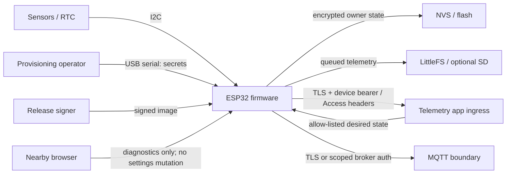

# Motorsport data acquisition threat model

## Executive summary

The logger handles reusable network credentials and publishes safety-relevant
motorsport telemetry from a physically accessible vehicle. The highest risks are
unauthorized re-commissioning, extraction of device credentials, installation of
unapproved firmware, and forged remote configuration. The present changes remove
the ESP32 fallback AP, password OTA, and local HTTP settings, and add a fail-closed
runtime security gate. Production remains blocked until Secure Boot v2 and unique
flash encryption are manufactured and verified, signed OTA with rollback exists,
and per-device recovery authorization replaces trust in a plaintext serial
provisioning session.

## Scope and assumptions

In scope: ESP32 firmware, factory and owner NVS, USB/UART provisioning, local
Wi-Fi/web surfaces, authenticated HTTPS or MQTT transport, remote-management
desired state, onboard queue, OTA/recovery, release artifacts, and manufacturing
eFuse enrollment. The telemetry app, Cloudflare Access, broker, gateway, and CI
signer are external dependencies at their firmware-facing boundaries.

The attacker may be nearby on wireless networks or may have temporary,
non-invasive physical access including USB/UART and ordinary flash-read attempts.
Destructive laboratory attacks, decapsulation, permanent vehicle theft, and
physical denial of service are out of scope. Production ESP32s are assumed to be
irreversibly enrolled with Secure Boot v2, unique release-mode flash-encryption
keys, and insecure debug/download disabled where supported. Development boards
remain separately identified and unenrolled. A physical owner may wipe owner
state, but credential reissue requires a unique per-device recovery credential
and server/admin authorization; no universal recovery secret is permitted.

## System model

### Components

- ESP32 application, bootloader, OTA partitions and eFuse security state.
- ADS1115/sensors, RTC, optional SD, and LittleFS store-forward queue.
- Factory identity metadata and owner credential/configuration NVS.
- USB manufacturing/provisioning station and non-secret inventory.
- Local Wi-Fi/web diagnostics surface.
- Cloudflare Access plus telemetry app HTTPS ingest, or device-scoped MQTT.
- Optional remote-management desired configuration and release signer.

### Data flows and trust boundaries

The vehicle enclosure, USB connector, local LAN, public ingress, cloud services,
manufacturing station, and release signer are separate trust zones. USB
provisioning currently crosses into the device as plaintext. HTTPS credentials
are sent only through validated TLS, while MQTT confidentiality depends on the
deployed broker transport.

## Assets

- Secure Boot signing authority and per-device flash-encryption keys.
- Wi-Fi, MQTT, Cloudflare Access, app bearer, OTA/recovery credentials.
- Immutable `mda-<eFuse MAC>` identity and owner binding.
- Firmware authenticity, security version, and known-good OTA slot.
- Telemetry integrity, ordering, timestamp, and retained queue data.
- Remote-management opt-in and applied configuration version.
- Manufacturing inventory, release evidence, and audit trail.

## Attacker model

Relevant capabilities include LAN discovery, repeated HTTP/MQTT requests,
captured wireless or local serial traffic, stolen pairing codes, temporary access
to the USB connector, ordinary flash dumping, replay of old desired documents,
and submission of malicious firmware to an exposed update path. The attacker is
not assumed to possess cloud administrator access, signing keys, destructive lab
equipment, or indefinite custody of the unit.

## Entry points

- USB/UART provisioning and factory-reset button.
- Wi-Fi station traffic and any fallback AP.
- `/`, `/diagnostics`, `/api/live`, files/download routes, and settings routes.
- HTTPS ingest/status responses and MQTT live/status/desired topics.
- OTA image delivery, boot selection, and recovery flow.
- NVS, LittleFS, optional SD, release artifacts, and manufacturing tooling.

## Top abuse paths

1. Capture a plaintext serial provisioning bundle, then reuse its cloud
   credentials away from the logger.
2. Obtain temporary physical access, dump unencrypted flash, and impersonate the
   device or recover owner Wi-Fi credentials.
3. Install an unsigned or older vulnerable application and bypass firmware
   checks before network startup.
4. Reach a fallback AP or local settings route and overwrite credentials or
   redirect telemetry.
5. Forge or replay remote desired configuration to disable upload or corrupt
   timestamps.
6. Trigger a bad update that never reaches healthy state and strands the logger
   without a known-good recovery slot.
7. Leak credentials through diagnostics, serial logs, release metadata, or fleet
   inventory.

## Threat model table

| ID | Threat / abuse case | Preconditions | Impacted assets | Existing controls | Required mitigation / status |
| --- | --- | --- | --- | --- | --- |
| TM-001 | Reuse captured USB provisioning secrets | Temporary USB/UART observation | All owner/cloud credentials | Short boot window; identity-bound payload | Add per-device challenge/proof and authorized issuance; current plaintext workflow is a production blocker |
| TM-002 | Dump flash and impersonate logger | Temporary physical access, unenrolled or misconfigured chip | Credentials, identity binding | Runtime reports security state | Unique release-mode flash encryption before provisioning; runtime network gate; physically verify eFuses |
| TM-003 | Boot unsigned firmware | Write access to flash/update surface | Firmware authenticity, credentials | ESP32 Arduino OTA disabled; production gate | Secure Boot v2 and signed binaries in actual SDK/manufacturing build; audit currently classifies bundled SDK development-only |
| TM-004 | Roll back to vulnerable signed firmware | Access to update/recovery path | Firmware integrity, security fixes | Dual OTA slots and bootloader rollback option | Define security-version/anti-rollback policy and signed OTA health confirmation; not implemented |
| TM-005 | Unauthorized nearby commissioning via AP | Nearby wireless, unprovisioned device | Owner binding, Wi-Fi/cloud credentials | ESP32 fallback AP disabled; networking requires valid owner record | Physical USB plus per-device recovery proof; wireless denial needs physical test |
| TM-006 | Mutate or read credentials through local web | LAN access after provisioning | Credentials, endpoint integrity | ESP32 `/settings` GET/POST returns 410; diagnostics expose posture only | Static tests and traffic inspection must verify no alternate leak; protect physical ports |
| TM-007 | Replay/forge remote desired state | Compromised route/token or stale retained MQTT message | Upload availability, time config | Device ID match, complete allow-list, monotonic version; local opt-in | Enforce scoped server credential and TLS; verify replay/cross-device tests end to end |
| TM-008 | Cross-device credential use | Credential copied between loggers | Device identity, ingest integrity | Bearer subject and MQTT username bound to immutable ID | App/broker must reject cross-use and support revocation; physical two-device test remains required |
| TM-009 | Credential leakage in logs/UI/artifacts | Operator or remote diagnostics access | Reusable secrets | Secret-free inventory; write-only legacy fields; ESP32 settings disabled | CI/static checks plus serial/browser/traffic inspection; never include keys in release evidence |
| TM-010 | Bad image strands logger | Update accepted but application unhealthy | Availability, queued telemetry | Dual slots; store-forward preservation contract | Signed inactive-slot OTA, pending verification, health window and automatic rollback; not implemented |
| TM-011 | Unauthorized ownership recovery | Physical reset or leaked shared secret | Owner binding and scoped credentials | Deliberate five-second wipe preserves immutable ID | Unique recovery credential plus server/admin authorization; no universal secret; issuance not implemented |
| TM-012 | MQTT observation/tampering | Broker deployed without TLS on reachable network | Telemetry confidentiality/integrity, desired state | Device-scoped username/ACL contract | Production MQTT requires TLS and certificate validation; prefer authenticated HTTPS until verified |

## Criticality calibration

TM-001 through TM-004 are release blockers because they enable durable device
impersonation or arbitrary code execution with temporary access. TM-005, TM-006,
TM-007, TM-008, TM-010, and TM-011 are high priority because they compromise
ownership, availability, or trusted configuration. TM-009 is high when reusable
credentials are exposed and medium for non-secret identifiers. TM-012 is high on
an untrusted network and lower only on a demonstrably isolated development LAN.

## Focus paths

- `src/DeviceProvisioning.cpp`, `scripts/provision_device.py`, and
  `docs/provisioning.md`: replace plaintext trust with per-device proof and
  authorized recovery issuance.
- `platformio.ini`, the ESP-IDF sdkconfig, release workflow, and
  `scripts/check_production_security.py`: build and attest an actually signed,
  encrypted production image with the runtime gate enabled.
- OTA implementation and `docs/releases.md`: add signature enforcement,
  pending-verification health checks, known-good rollback and carefully governed
  anti-rollback.
- `src/WebUi.cpp`, `src/main.cpp`, and transport tests: verify local settings stay
  disabled, diagnostics remain secret-free, and desired state cannot cross
  device/version boundaries.
